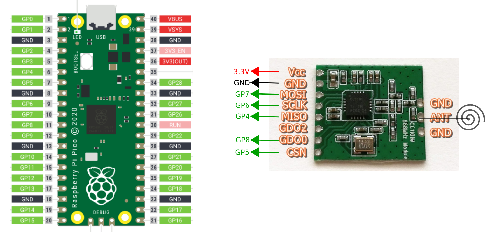
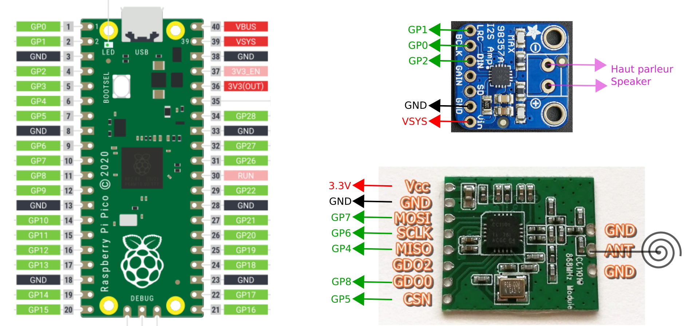

# circuitpython-nfs32002

Réimplémentation pour CircuitPython du protocole NF S 32-002 utilisé par les balises sonores des feux piétons. Permet de détecter le signal d'une télécommande à partir d'un module radio CC1101.

Le module utilise la bibliothèque CircuitPython [CPY-CC1101](https://github.com/balises-ouistici/CPY-CC1101) (code original par [unixb0y](https://github.com/unixb0y/CPY-CC1101)).

## Exemple d'utilisation avec un Raspberry Pico :

```python
import time
import board
from circuitpython_nfs3200 import CC1101_NFS32002

# radio module
radio = CC1101_NFS32002(board.GP6, board.GP7, board.GP4, board.GP5, board.GP8)

# boucle principale
while True:
    message_recu = radio.wait_for_data()    
    print("Ouistici !")
    time.sleep(0.1) 
```
Câblage correspondant :


## Exemple d'utilisation avec un message audio :

```python
import time
import board
import audiobusio
import audiocore
from circuitpython_nfs3200 import CC1101_NFS32002

# radio module
radio = CC1101_NFS32002(board.GP6, board.GP7, board.GP4, board.GP5, board.GP8)
# audio file
wave_file = open("message.wav", "rb") # 22 KHz sample rate (or less) and 16-bit, under 2MB
wave = audiocore.WaveFile(wave_file)
# audio output
audio = audiobusio.I2SOut(bit_clock=board.GP0, word_select=board.GP1, data=board.GP2)

# boucle principale
while True:
    message_recu = radio.wait_for_data()    
    audio.play(wave)
    while audio.playing:
        pass
    time.sleep(0.1) 
```
Câblage correspondant :

